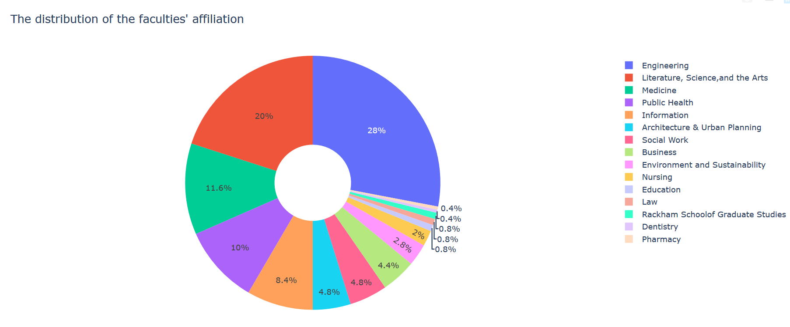

● Data sources used, including instructions for a user to access the data sources 

I will **crawl** two websites:

- (8 challenge score) I. https://midas.umich.edu/affiliated-faculty/

In this website, I will crawl a faculty list from MIDAS, including their name, title, brief description, long description,  email, affiliated organizations and so on. The secondary level page example is: https://midas.umich.edu/faculty-member/eytan-adar/

- (1 challenge score) II. https://www.si.umich.edu/programs/courses/catalog

In this website, I will crawl a course list from UMSI, including the course name, course number, credit, description, prerequire course and so on. The secondary level page example is: https://www.si.umich.edu/programs/courses/649

- (0 challenge score) III. https://umich.edu/schools-colleges/

I will scrape the school list and their website.(0 challenge point because of less than 5 fields)

● Any other information needed to run the program (e.g., pointer to getting started info for plotly)

https://plot.ly/

https://www.crummy.com/software/BeautifulSoup/bs4/doc/

● Brief description of how your code is structured, including the names of significant data processing functions (just the 2-3 most important functions--not a complete list) and class definitions. If there are large data structures (e.g., lists, dictionaries) that you create to organize your data for presentation, briefly describe them.

My code consists of two main parts:

1. Data access and storage part:

   make_request_using_cache(baseurl, f) 

   // This one take a function pointer f, which can be the following three function which take charge of the three data source's crawling and analysis

   get_school_list(page)

   // This is a function for a school list from https://umich.edu/schools-colleges/

   get_midas_data(page)

   // This is a function for a faculty list from https://midas.umich.edu/affiliated-faculty/

   get_umsi_data(page)

   // This is a function for a course list from https://www.si.umich.edu/programs/courses/catalog

   create_database(school_list_dic, people_dic, course_dic)

   // The function create a database

2. Data analysis and present 

   Four data processing function and four corresponding display function

   Process:

   school_distribution_data(faculty_filter, DBNAME)

   keyword_data(faculty_filter, DBNAME)

   keyword_search_data(faculty_filter, DBNAME, custom_keyword)

   course_recommendation_data(faculty_filter, DBNAME, faculty_name)

   Display:

   school_distribution_plot(data)

   keyword_plot(data)

   keyword_search_plot(data, keyword)

   course_recommendation_plot(data, faculty_name)

● Brief user guide, including how to run the program and how to choose presentation options.

The interactive command syntax is as following:

***The following is the filter command***

- **filter {first-aff=} {second-aff=} {campus=}**
  Description: 
  	This command sets a new filter for the faculty.
  Argument:
  	 {first-aff=}: Indicate the first affiliation school of the faculty. Please write the exact name of the school.
  	{second-aff=}: Indicate the second affiliation school of the faculty. Please write the exact name of the school.
  	    {campus=}: Indicate the location of the faculty. 'N' for North Campus and 'C' for Central Campus.
  Example:
  	filter campus=C first-aff=Information
- **show-filter**
  Description:
  	This command shows the current filter on the dataset.
- **clear-filter**
  Description:
  	This command sets the filter to the default(All data).

***The following is the presentation  command***

- **keyword**
  Description:
  	This command shows the faculty's description keywords on a scatter point plot.

- **school-distribution**
  Description:
  	This command shows the faculty's first affiliation on a pie chart

- **keyword-search {a list of words separated by comma}**
  Description:
  	This command use the list of words to search the most match faculty and present on a Stacked Bar Chart
  Example:
  	keyword-search health, language

- **course-recommendation {faculty name}**
  Description:
  	This command use the list of words to search the most match course in UMSI and present on a table
  Example:
  	course-recommendation Ho-Joon Lee

